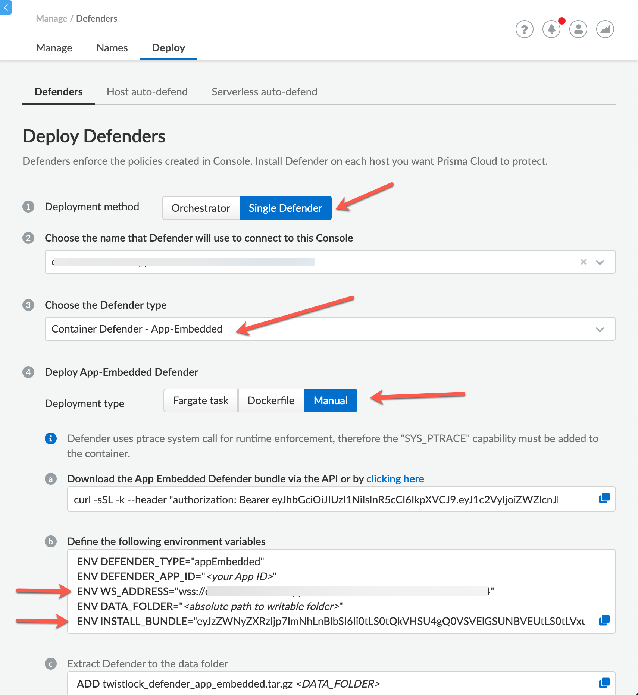

# PC_AWS_FARGATE_CloudFormation

## This repo provide a manual mockup on how to protect a Fargate task defined in AWS CloudFormation YAML.

### Objective

This repo has 2 files:
 - Sample_Task.yaml
 - Sample_Protected_Task.yaml

### Parameters used in the Example (Should be customized to your configuration)

#### TASK_NAME_TO_BE_PROTECTED

    twistlock-fargate-task

#### CONTAINER_NAME_TO_BE_PROTECTED
     
    twistlock-fargate-task

#### IMAGE_NAME_TO_BE_PROTECTED
     
    matthewabq/twistlock-fargate-auto

#### INSTALL_BUNDLE_STRING and WS_CONSOLE_ADDRESS

In the Prisma Cloud UI navigate to Compute | Manage | Defenders | Deploy. Choose Single Defender -> Defender Type -> Manual and copy the values as shown below.

   

#### PATH_IMAGE_TWISTLOCK_LOCAL_REGISTRY

Pull the images from the Prisma Cloud cloud registry using your access token. The major, minor, and patch numerals in the <VERSION> string are separated with an underscore. For exampe, 18.11.128 would be 18_11_128.

    docker pull registry-auth.twistlock.com/tw_<ACCESS_TOKEN>/twistlock/defender:defender_<VERSION>
    
Tag the images for your internal registry.

    docker tag  registry-auth.twistlock.com/tw_<ACCESS_TOKEN>/twistlock/defender:defender_<VERSION> <Your_Registry>/defender:defender_<VERSION>

Push the images to the twistlock project’s imageStream.

    docker push <Your_Registry>/defender:defender_<VERSION>
